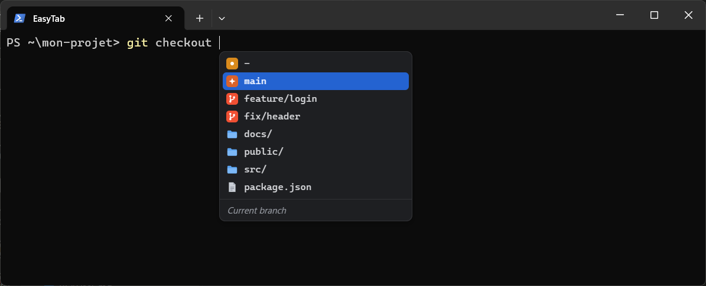
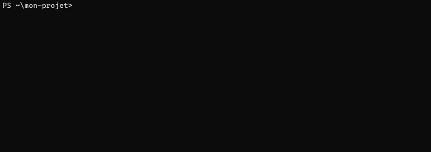
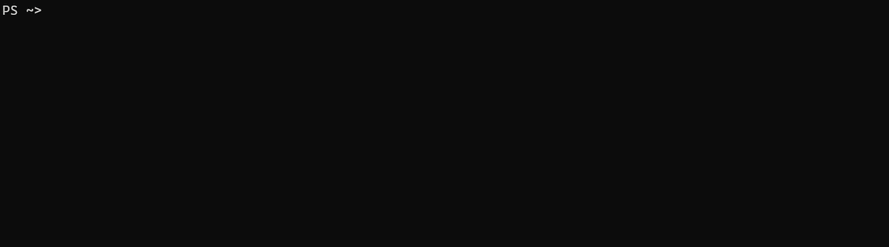

<p align="center">
  
</p>

<h1 align="center">
  <picture>
    <source media="(prefers-color-scheme: dark)" srcset="docs/images/title-dark.svg">
    
  </picture>
</h1>

<p align="center"><b>English</b> · <a href="README.fr.md">Français</a></p>

<p align="center">
  IDE-style autocomplete for your terminal.<br>
  Windows, macOS and Linux · PowerShell, bash, zsh and Git Bash.
</p>

<p align="center">
  
</p>

---

As you type a command, EasyTab opens a small list under the cursor: subcommands, options, git
branches, npm scripts, files… with their description. Pick one, press Tab, it's written.

- **Over 700 commands** out of the box, thanks to the [Fig](https://github.com/withfig/autocomplete)
  specs: git, docker, npm, kubectl, composer, symfony…
- **Your project's values**: branches, `package.json` scripts, `Makefile` targets, SSH hosts,
  docker containers.
- **Your history** at the top of the list (commands run in the current folder first), the
  suggestions you pick most often, and Ctrl+R to search all of it.
- **Typo fixes**: after `gti status` fails, `git status` waits in grey at the next prompt.
- **Workflows**: saved commands with fields to fill in, like `docker exec -it {container} bash`.
- **Your shell**: aliases (`g push` completes like `git push`), environment variables (`$HOME`),
  and the completions of bash-completion or fish for commands without a spec.
- **Nothing to learn**: your terminal and shell stay yours, the list never grabs the keyboard.

<p align="center">
  
</p>

## Install

```sh
# macOS, Linux
curl -fsSL https://github.com/AdamSellin/EasyTab/releases/latest/download/install.sh | sh
```

```powershell
# Windows (PowerShell and Git Bash)
irm https://github.com/AdamSellin/EasyTab/releases/latest/download/install.ps1 | iex
```

<p align="center">
  
</p>

Then open a new terminal. To update: `easytab update`.
On a company PC that blocks the script: [install without it](docs/guide.md#pc-dentreprise) (in
French): download the Windows zip, then run `.\easytab.exe install --shell pwsh` from it.

## Use

| Key | Action |
|---|---|
| ↑ ↓, Shift+Tab | Pick a suggestion |
| Tab | Write it |
| Enter | Write it if it completes the typed word, otherwise run the command |
| Esc | Close the list |
| Ctrl+Space | Open it again after Esc |
| → | Accept the grey suggestion (history, typo fix, next command such as `git push`, rest of a workflow) |
| Ctrl+R | Search the whole history |

| Command | |
|---|---|
| `easytab config` | Opens the settings (`~/.easytab/config.toml`) |
| `easytab workflows` | Opens your workflows (`~/.easytab/workflows.toml`) |
| `easytab doctor` | Checks the installation |
| `easytab update` | Installs the latest version |
| `easytab uninstall` | Removes EasyTab from the shell |

Messages are in English, or in French if your system is (`EASYTAB_LANG=en` to force English).

Everything else (settings, custom specs, building from source) is in the
[guide](docs/guide.md) (in French for now).

## Code signing and privacy

Windows releases are not code-signed yet. They are built by the
[Release workflow](.github/workflows/release.yml) on GitHub-hosted runners, from the tagged
source.

Privacy: this program will not transfer any information to other networked systems unless
specifically requested by the user or the person installing or operating it. Only
`easytab update` contacts GitHub, to download the latest release; it checks the archive
against the release's `SHA256SUMS` before installing it.

## License

MIT. Completion specs come from [withfig/autocomplete](https://github.com/withfig/autocomplete)
(MIT, see [specs/LICENSE-fig](specs/LICENSE-fig)).
